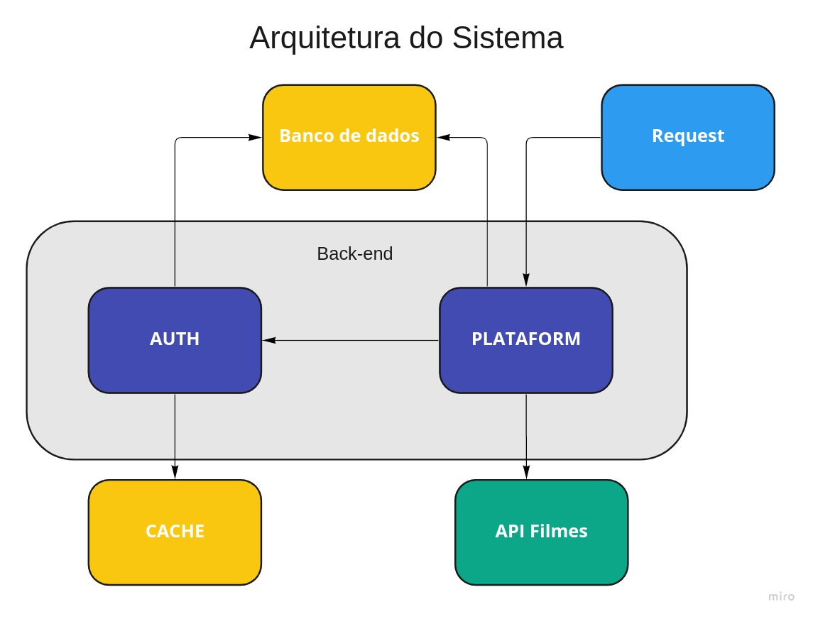
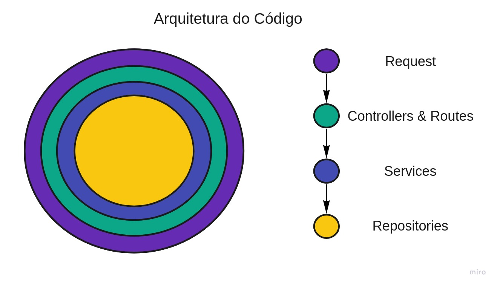
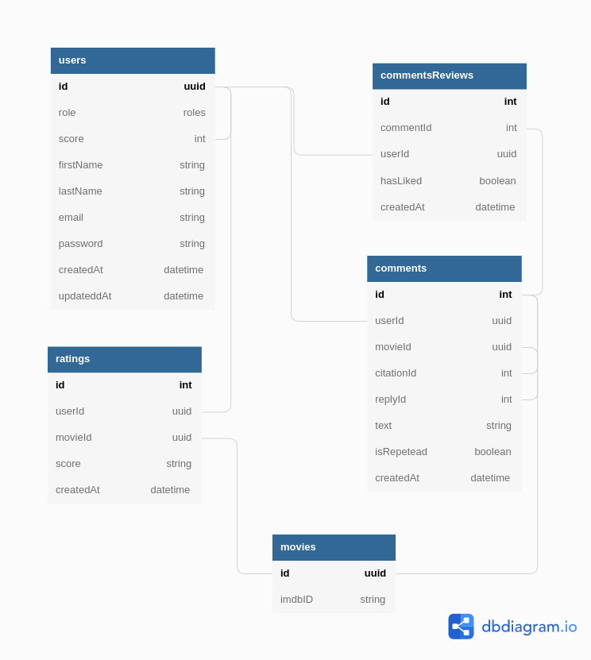

# itau-coding-challenge

Projeto referente a quinta e última etapa do processo seletivo do [Bootcamp Itaú Dev Experts](https://letscode.com.br/processos-seletivos/itau-bootcamp-dev) realizado em parceria com a [Let's Code](http://letscode.com.br/).

## Requisitos

Os requisitos do projeto podem ser encontrados no arquivo [REQUISITOS.md](assets/REQUISITOS.md) presente na pasta *assets* do projeto.

## Tecnologias utilizadas

- [NodeJs](https://nodejs.org/)
    - [Typescript](https://www.typescriptlang.org/)
    - [Express](https://expressjs.com/)
    - [Prisma](https://prisma.io/)
- [PostgreSQL](https://www.postgresql.org/)
- [Docker](https://www.docker.com/) 
    - [Docker Compose](https://docs.docker.com/compose/install/) 

## Como executar

### Instalar

Para facilitar a execução do projeto foram criados containers para as ambas APIs (plataforma e autenticação) e também para o banco de dados Postgres. Dessa forma, podemos executar todo o fluxo somente com o Docker e o Docker Compose instalados no ambiente.

- [Docker](https://www.docker.com/) (Utilizei a versão 20.10.1)
- [Docker Compose](https://docs.docker.com/compose/install/) (Utilizei a versão 1.27.4)

### Configurar

- Clone o projeto e entre na pasta com os seguintes comandos:
    ```
        git clone git@github.com:guivahl/itau-coding-challenge.git && cd itau-coding-challenge/
    ```
    
- **IMPORTANTE:** Para conexão com a API externa é necessário gerar uma **API_KEY** no site. Para isso, é necessário um simples cadastro com a utilização de um endereço de email válido. A criação da chave pode ser gerada nesse [link](https://www.omdbapi.com/apikey.aspx).

    - Após geração da chave, é necessário adicionar a chave em um arquivo chamado **.env** dentro da pasta *apps/plataform*. Essa ação pode ser realizada com o seguinte comando:
    ```
    touch apps/plataform/.env

    echo "MOVIE_API_KEY={INSIRA_KEY_AQUI}" >> apps/plataform/.env
    ```

- Antes de executar o projeto a primeira vez é necessário realizar a construção da imagem Docker. Para isso, execute o seguinte comando:
    ``` 
    make build
    ```

### Executar


- Após a criação da imagem, podemos instanciar os containers com o comando:
``` 
make up
```

- Caso deseje executar os containers visualizando os logs de criação, execute:
``` 
make logs
```

- Para parar a execução dos containers do sistema, execute:
``` 
make down
```

### Rotas

Durante o projeto utilizei o [Insomnia](https://insomnia.rest/) para realizar as requisições ao servidor pois considero o software enxuto e de fácil utilização. Criei uma documentação nele e recomendo o mesmo para testagem de aplicação. \
Caso opte pelo Insomnia, é necessário definir algumas [variavéis de ambiente](https://docs.insomnia.rest/insomnia/ environment-variables) no programa. 
- No arquivo [ROTAS.md](assets/ROTAS.md) há uma documentação de como configurar essas variáveis e também uma relação entre **Funcionalidades x Rotas** do sistema.
- Para as rotas autenticadas, é necessário realizar uma requisição de Login válida e armazenar o token retornado pela API na variável **AUTH_TOKEN**.

[](https://insomnia.rest/run/?label=itau-coding-challenge&uri=https://github.com/guivahl/itau-coding-challenge/blob/main/assets/insomnia.json)

### Seeds

Para facilitar os testes em ambiente de desenvolvimento, foram criados arquivos de **seeds** para criação de usuários com todas *roles* possíveis no banco de dados. Caso tenha optado por rodar o projeto via Docker, as seeds são executadas automaticamente.

Login para os usuários criados via seed:
```
{
    email: ['vahl-leitor@gmail.com', 'vahl-basico@gmail.com','vahl-avancado@gmail.com','vahl-moderador@gmail.com']
    senha: 'senha123'
}
```

## Arquitetura

### Sistema

O sistema possui dois serviços principais: o da plataforma, que possui as principais regras de negócio, e o de autenticação, que realiza a validação de credenciais do usuário. Ambos utilizam o mesmo banco de dados. \
- O serviço da plataforma realiza consultas a API [The Open Movie Database](https://www.omdbapi.com/) para obter informações sobre os filmes e requisições ao serviço de autenticação para validar os acessos. \
- O serviço de autenticação utiliza um banco de dados cache para armazenar tentativas inválidas de login.




### Código

A arquitetura de código escolhida foi inspirada em conceitos de `Arquitetura limpa`. Utilizamos, em ambos serviços, camadas de abstração com diferentes responsabilidades.

- Camadas:
    - Server ⇒ Lida com as requisições recebidas pelo sistema
    - Controllers & Routes ⇒ Responsáveis por receber e devolver os dados para cada endpoint
    - Services ⇒ Regras de negócio, aciona repositórios do banco e consulta API externa
    - Database Repositories ⇒ Realiza operações no banco de dados



### Banco de dados

Pelas regras de negócio e requisitos definidos optei por utilizar um banco de dados relacional SQL. O banco de dados escolhido para esta aplicação foi o [Postgres](https://www.postgresql.org/). \
A fim de obter uma maior abstração na conexão e operações com a instância do banco, optei pela utilização de um ORM em ambos serviços. O ORM escolhido foi o [Prisma](https://www.prisma.io/). 

O diagrama relacional foi construído especificamente para a aplicação e se encontra logo abaixo. Para maiores informações sobre as tabelas e respectivas colunas acesse o arquivo [TABELAS.md](assets/TABELAS.md). 



### Melhorias futuras

O projeto foi realizado ao longo do período de 10 dias. Devido ao tempo limitado, não consegui realizar todas as funcionalidades que desejava inicialmente. Segue em anexo o que faria em sequência, a fim de otimizar o projeto:

- Adicionar testes, unitários e E2E.
- Adicionar cache na utilização de chamadas externas para consulta de filmes.
- Adicionar logger de requisições.
- Adicionar comandos de `build` para ambiente de produção.
- Comando de execução das API's no docker está realizando download de um pacote e executando as migrations sempre que é chamado. Tive alguns problemas de autorização com o prisma dentro do docker, foi a forma que encontrei para solucionar o problema com o tempo que tinha disponível.