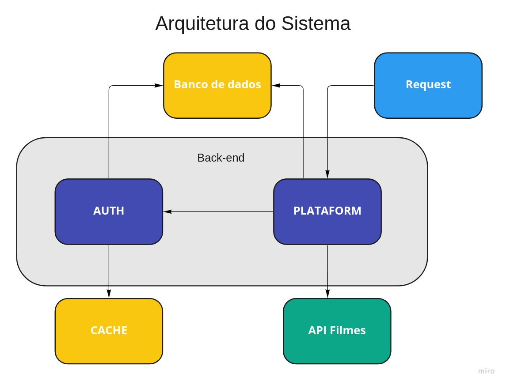
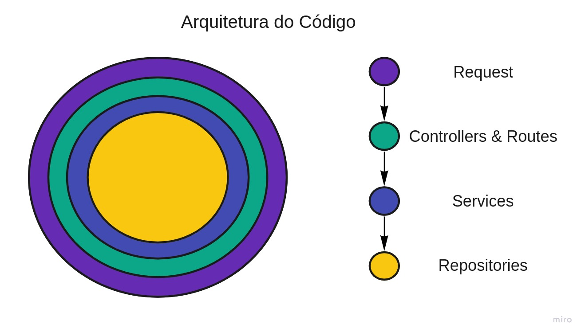
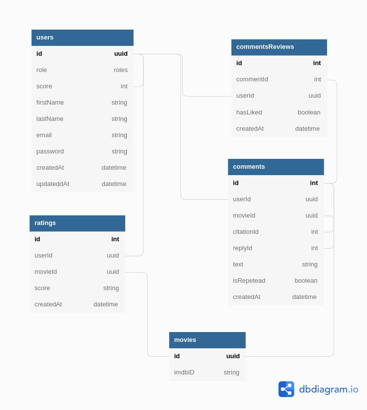

# itau-coding-challenge

Projeto referente a quinta e última etapa do processo seletivo do [Bootcamp Itaú Dev Experts](https://letscode.com.br/processos-seletivos/itau-bootcamp-dev) realizado em parceria com a [Let's Code](http://letscode.com.br/).

## Requisitos

Os requisitos do projeto podem ser encontrados no arquivo [REQUISITOS.md](assets/REQUISITOS.md) presente na pasta *assets* do projeto.

## Arquitetura

### Sistema

O sistema possui dois serviços: o da plataforma, que possui as principais regras de negócio, e o de autenticação, que realiza a validação de credenciais do usuário. Ambos utilizam o mesmo banco de dados. \
O serviço da plataforma realiza consultas a API [The Open Movie Database](https://www.omdbapi.com/) para obter informações sobre os filmes e requisições ao serviço de autenticação para validar os acessos. \
O serviço de autenticação utiliza um banco de dados cache para armazenar tentativas inválidas de login.

Diagrama:

### Código

A arquitetura de código escolhida foi inspirada em conceitos de Arquitetura limpa. Utilizamos, em ambos serviços, camadas de abstração com diferentes responsabilidades.

- Camadas:
    - Server ⇒ Lida com as requisições recebidas pelo sistema
    - Controllers & Routes ⇒ O servidor direciona a chamada para um controller, que é re
    - Services ⇒ Regras de negócio, aciona banco e API externa
    - Database Repositories ⇒ Acessa os dados do banco

Diagrama:

### Banco de dados

Pelas regras de negócio e requisitos definidos optei por utilizar um banco de dados relacional SQL. O banco de dados escolhido para esta aplicação foi o [Postgres](https://www.postgresql.org/). \
A fim de obter uma maior abstração na conexão e operações com a instância do banco, optei pela utilização de um ORM em ambos serviços do sistema. O ORM escolhido foi o [Prisma](https://www.prisma.io/). 

O diagrama relacional foi construído especificamente para a aplicação e se encontra logo abaixo. Para maiores informações sobre as tabelas e respectivas colunas acesse o arquivo [TABELAS.md](assets/TABELAS.md). 

Diagrama:

